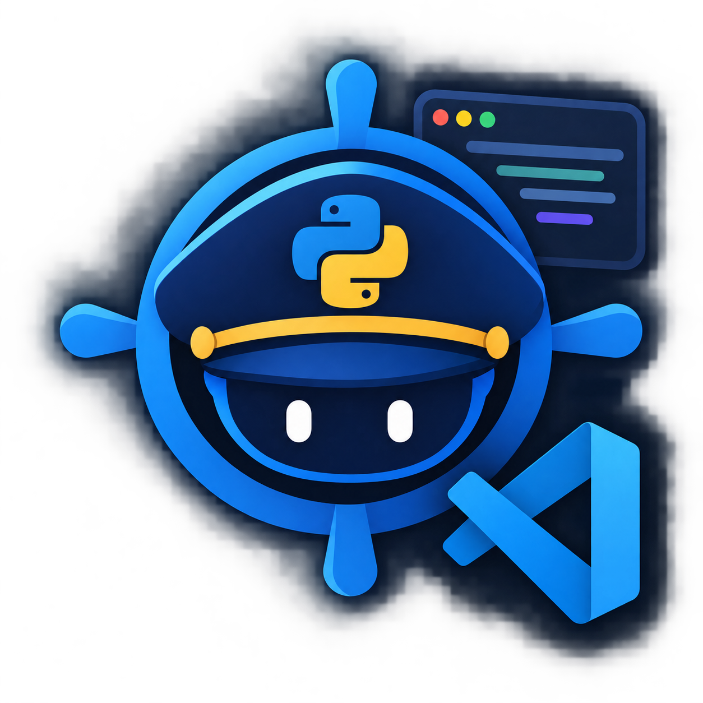

<p align="center">
  
</p>

# PyPilot for VS Code

PyPilot inspects Python projects, figures out which Python versions your dependencies actually support, and creates a working virtual environment. It resolves driver and CUDA compatibility for PyTorch or TensorFlow, checks package wheels on PyPI, and flags broken imports directly in the editor without external API calls.

This extension runs the same native Rust engine as [PyPilot for Zed](https://github.com/Abdullah-Masood-05/pypilot), integrated with VS Code surfaces: the command palette, status bar, progress indicators, interactive doctor report panel, and workspace tasks.

## Features

- **Environment setup**: Runs `uv init` and `uv add` when no `pyproject.toml` exists. In pip mode, records installations using `pip freeze > requirements.txt`.
- **Python version resolution**: Evaluates PyPI wheel availability against `requires_python` to find an interpreter version that satisfies all dependencies.
- **Hardware matching**: Inspects host NVIDIA drivers via `nvidia-smi` and aligns `torch` or `tensorflow` with the correct CUDA runtime wheel.
- **Import diagnostics**: Flags missing or incompatible package imports in open files, with quick fixes to install or resolve them.
- **Onboarding prompt**: Scans opened folders and displays an actionable alert when environment issues need attention.
- **Status bar**: Displays interpreter state in the status bar with quick access to the report panel.
- **Task integration**: Provides workspace task definitions for environment bootstrap, health checks, and package maintenance.
- **Report panel**: Renders the doctor diagnostics report in an interactive webview panel.

## Requirements

- VS Code 1.85 or later.
- Network access during initial startup to download the native `pypilot` helper binary (approximately 3 MB).
- Python does not need to be installed beforehand when using `uv` mode; `uv` downloads required interpreters directly.

## Getting started

1. Open a Python project directory in VS Code.
2. PyPilot activates and scans the environment.
3. If an issue is found, a prompt appears with options to run the automatic fix or inspect the report.
4. The environment is configured on the Python version supported by your project dependencies.

## Commands

| Command | Action |
|---|---|
| `PyPilot: Set Up Environment` | Bootstraps the environment, installs Python if needed, and installs dependencies |
| `PyPilot: Doctor: Show Environment Report` | Runs a health check and displays the interactive report panel |
| `PyPilot: Fix Python Version` | Recalculates compatible versions and rebuilds the virtual environment |
| `PyPilot: Fix CUDA / PyTorch Build` | Re-pins machine learning dependencies to the driver-supported build |
| `PyPilot: Check Package Compatibility...` | Checks whether a specific package runs on the current Python version |
| `PyPilot: Install Package...` | Installs a package and updates the project manifest |
| `PyPilot: Update Bundled Data Tables` | Updates cached hardware and framework compatibility data |
| `PyPilot: Migrate Conda environment.yml to pyproject.toml` | Translates conda environment definitions into pyproject.toml |

## Settings

| Setting | Default | Description |
|---|---|---|
| `pypilot.packageManager` | `"uv"` | Selects `uv` or `pip`. |
| `pypilot.notifications` | `"problems-only"` | Configures notification verbosity: `all`, `problems-only`, or `off`. |
| `pypilot.autoCheckOnOpen` | `true` | Automatically checks the environment when opening a workspace. |
| `pypilot.dataRefreshDays` | `7` | Refresh interval in days for compatibility data tables (0 disables updates). |

## Architecture

The extension is a TypeScript client wrapping the native Rust `pypilot` helper binary. On startup, the extension checks PATH for an existing binary and downloads a release if none is found. The helper communicates over standard I/O via the Language Server Protocol.

```
pypilot-vscode/
├── src/
│   ├── extension.ts        LanguageClient activation and onboarding flow
│   ├── downloader.ts       Binary resolution and release downloads
│   ├── statusBar.ts        Editor status bar indicator
│   ├── commands.ts         Command palette actions
│   ├── tasks.ts            Workspace task provider
│   └── webview/
│       └── reportPanel.ts  Interactive HTML doctor report webview
├── build.ts                Bun build script
├── bunfig.toml
└── package.json
```

## Development

Build and package scripts use Bun:

```bash
# Install dependencies
bun install

# Compile extension
bun run build

# Watch mode during development
bun run build --watch

# Build vsix package
bun run package
```

## License

AGPL-3.0-or-later. See the project repository license for details.
